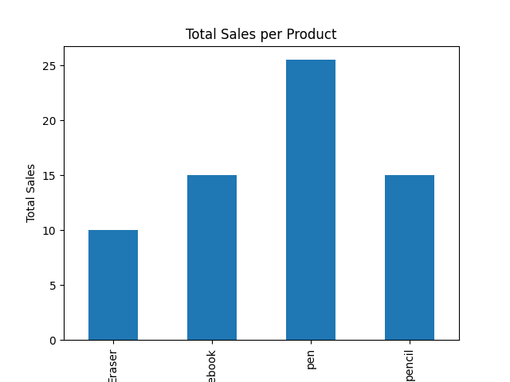

# Sales Data Analysis

This is a beginner data analysis project using Python and Pandas.

## Project Description
This project reads sales data from a CSV file and calculates total sales for each product.

## Technologies Used
- Python
- Pandas
- Matplotlib

## Files
sales.csv – dataset  
sales_analysis.py – Python analysis script  
sales_chart.png – visualization of total sales per product

## Sales Chart

